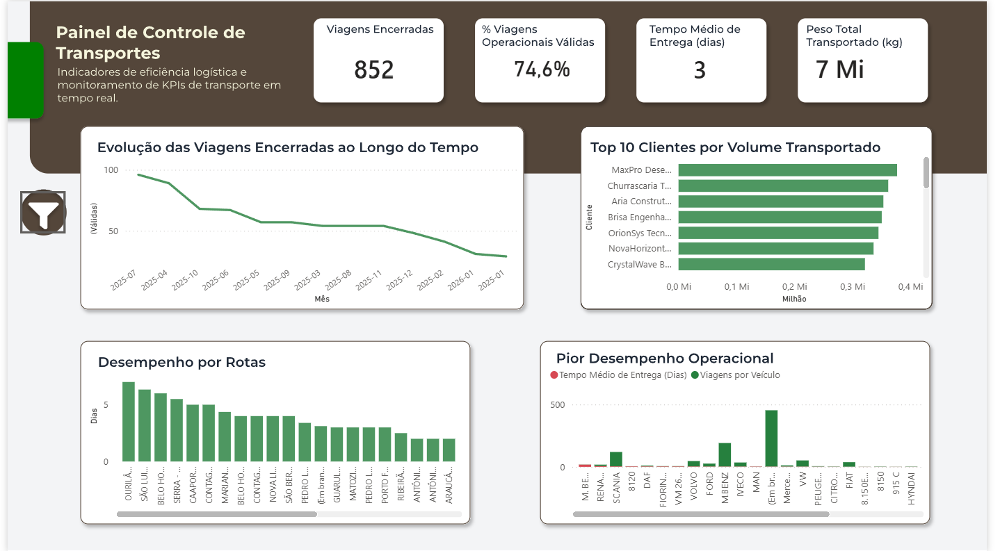
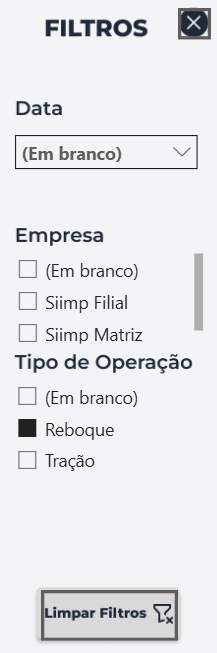

# 📊 Dashboard Logística – Teste Técnico Power BI

## 🎯 Objetivo do Desafio

Construir um **dashboard gerencial de transporte** que permita:

- Acompanhar a **performance operacional**
- Analisar o **desempenho das entregas ao longo do tempo**
- Identificar os **melhores clientes e rotas**
- Identificar **veículos e motoristas com pior desempenho**
- Incluir análises adicionais relevantes para apoiar a **gestão do transporte**

O foco da solução é transformar dados brutos em **informação confiável e acionável**, seguindo boas práticas de BI.

---

## 📦 Bases de Dados Utilizadas

As seguintes bases foram fornecidas para o desenvolvimento do desafio:

- **Viagens** (tabela fato)
- **Status**
- **Veículos**
- **Rotas**
- **Clientes**
- **Empresa**

📁 Os dados brutos estão organizados na pasta `data/`, mantendo a separação entre **origem** e **análises**.

---

## 🧹 Tratamento e Qualidade dos Dados

Antes da construção do dashboard, foi realizada uma etapa de **saneamento e preparação dos dados no Power Query**, incluindo:

- Correção de **tipos de dados** (datas, números e textos)
- Remoção de colunas sem valor analítico
- Padronização de categorias operacionais
- Tratamento de valores nulos e inconsistentes
- Criação de **regras de negócio**, como:
  - Identificação de **viagens válidas**
  - Cálculo da **duração da viagem**
  - Criação de campos auxiliares para análise temporal

Essas decisões garantem que os indicadores apresentados reflitam **operações reais e consistentes**.

---

## 🧠 Modelagem de Dados

O modelo foi estruturado no formato **Estrela (Star Schema)**, com:

- **Tabela Fato**: Viagens  
- **Tabelas Dimensão**: Clientes, Veículos, Rotas, Status, Empresa e Tempo  

Essa abordagem melhora:
- Performance
- Clareza analítica
- Manutenção do modelo

---

## 📈 KPIs Principais

No topo do dashboard foram definidos indicadores executivos essenciais:

- **Viagens Encerradas**
- **% de Viagens Operacionais Válidas**
- **Tempo Médio de Entrega (dias)**
- **Peso Total Transportado**

Esses KPIs oferecem uma visão rápida da **saúde da operação logística**.

---

## 📊 Análises Disponíveis no Dashboard

O dashboard foi dividido em blocos analíticos para facilitar a tomada de decisão:

- 📈 **Evolução das viagens encerradas ao longo do tempo**
- 🏆 **Top 10 clientes por volume transportado**
- 🛣️ **Tempo médio de entrega por rota**
- 🚨 **Veículos com pior desempenho operacional**

Os gráficos foram escolhidos priorizando **clareza visual, comparação e leitura gerencial**.

---

## 🧭 Navegação e Usabilidade

O relatório conta com uma **página de capa**, utilizada como ponto inicial da navegação, com acesso ao dashboard principal por meio de botão interativo.

### 🖥️ Capa do Dashboard


### 📊 Dashboard Principal


### 🎛️ Painel de Filtros


Os filtros foram organizados em um **painel lateral retrátil**, evitando poluição visual e permitindo uma experiência mais fluida ao usuário.

---

## 📁 Estrutura do Repositório

```text
Teste-Siimp-BI/
│
├── README.md
│
├── data/
│   └── Exercicio_BI_Teste.xlsx
│
├── dashboard/
│   └── Dashboard_Logistica.pbix
│
├── docs/
│   ├── Capa.png
│   ├── Dashboard.png
│   └── Filtros.png
